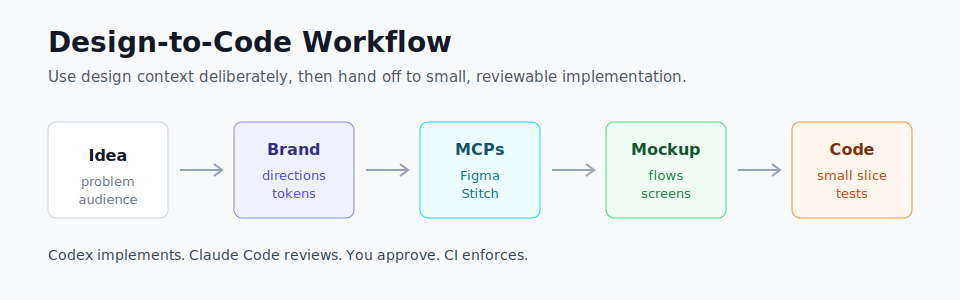

# Design Start Workflow

Use this folder at the beginning of a new app/project idea.



The goal is to move from:

```text
rough idea -> brand directions -> screen concepts -> interactive mockups -> implementation plan -> safe coding workflow
```

Recommended flow:

```text
1. Brand discovery
2. Three design directions
3. Pick/refine one direction
4. Use Figma/Stitch/21st.dev/Rive MCPs if useful
5. Generate static screen specs
6. Generate interactive mockups if useful
7. Decide design system/brand kit
8. Ask Codex/Claude to inspect repo and plan implementation
9. Codex implements small slice
10. Claude reviews diff
```

## Should I use desktop tools for UI work?

Often, yes.

Desktop tools are useful for UI/design work because you can see:

```text
- visual previews
- diffs
- generated screens
- running app previews
- multiple agent sessions
- mockups and design iterations
```

CLI is still excellent for:

```text
- repo inspection
- implementation
- tests
- lint/typecheck/build
- git workflow
- emulator commands
```

Recommended split:

```text
Desktop/IDE = UI preview and visual iteration
CLI = serious implementation, testing, git, Android emulator/AVD
```

## Should interactive mockups be part of the design stage?

Yes, for many projects.

Interactive mockups are especially useful when you want to test:

```text
- navigation flow
- screen hierarchy
- dashboard layout
- onboarding flow
- form interactions
- empty states
- motion ideas
- responsive layouts
```

But treat them as design artefacts, not production code.

Best rule:

```text
Interactive mockup = prototype for thinking
Production implementation = separate, repo-aware, reviewed code
```

Use React/Tailwind mockups when you want fast visual exploration. Then ask the coding agent to translate the selected direction into your actual stack, such as Android/Jetpack Compose, SwiftUI, Flutter, React Native, or web.
